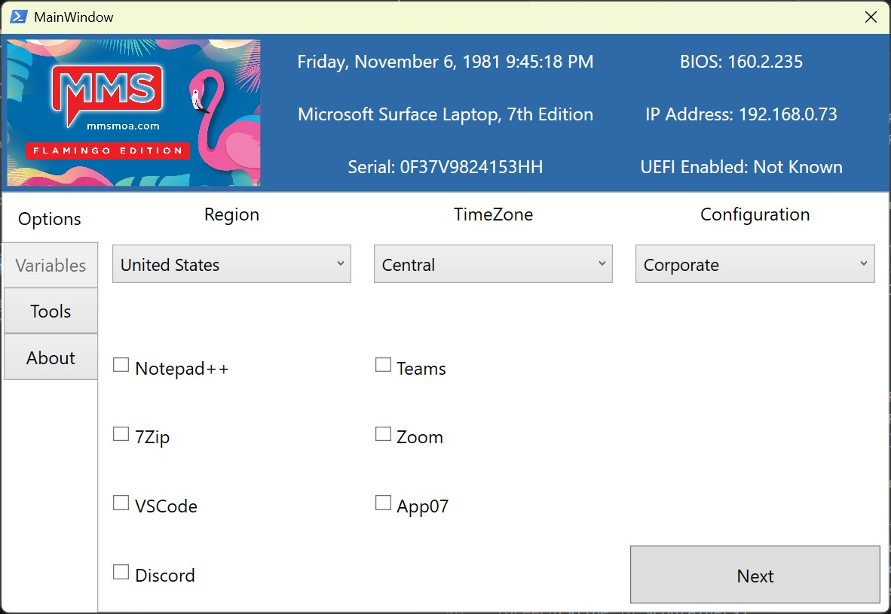
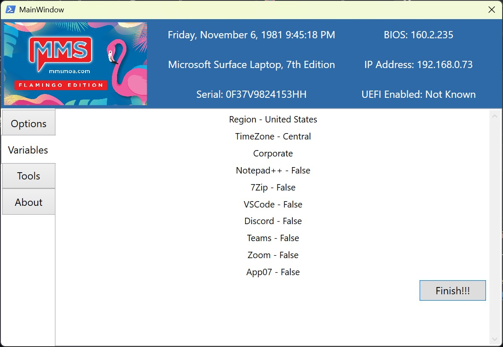
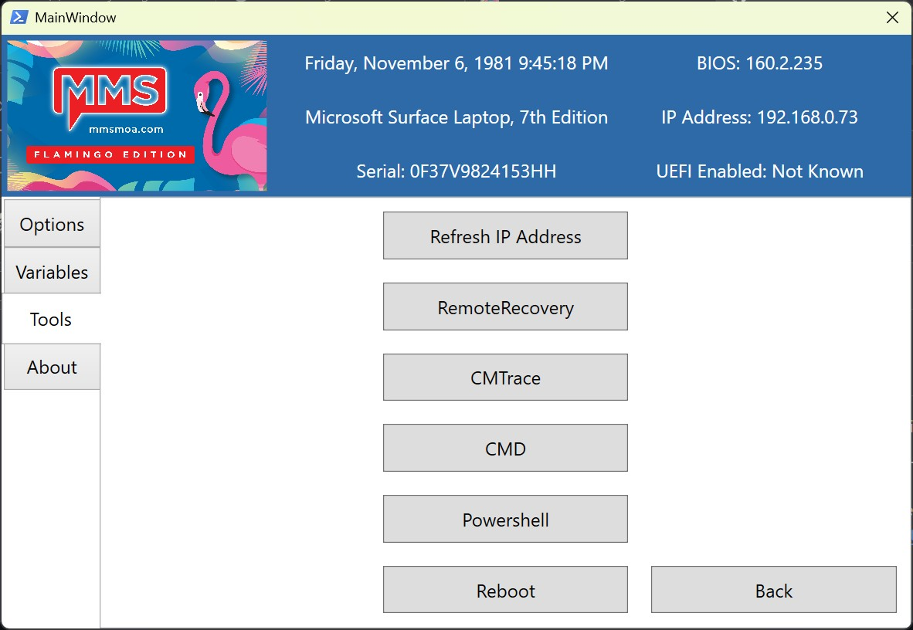
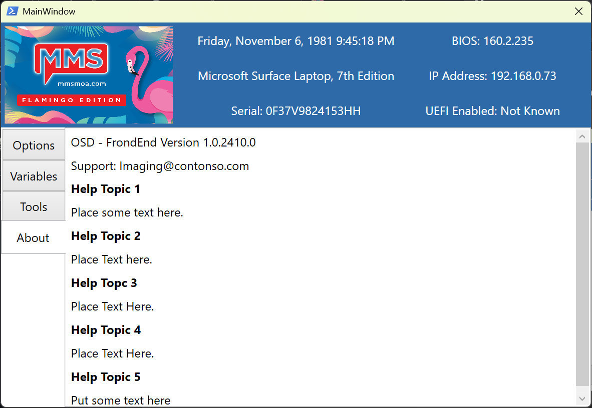

# OSD-FrontEnd
Another front end application for OSD using XML and Powershell. Branded for Midwest Management Summit Flamingo Edition. 

Run ths at the begining of your OSD Task Sequences to set common and custom Task Sequnce Envirnment viaribles. 

Useage: Add as a prestart command to your boot media or USB media. You can either run Start-OSDFrontEnd.ps1 directly or use the included RunSilent.exe (Credit for RunSilent goes to OneVinn https://onevinn.schrewelius.it/Apps01.html)

Most customizations are done via the included csv files and logo.png
